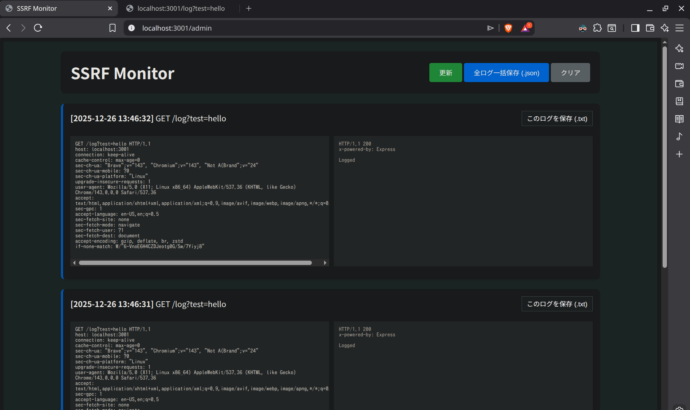
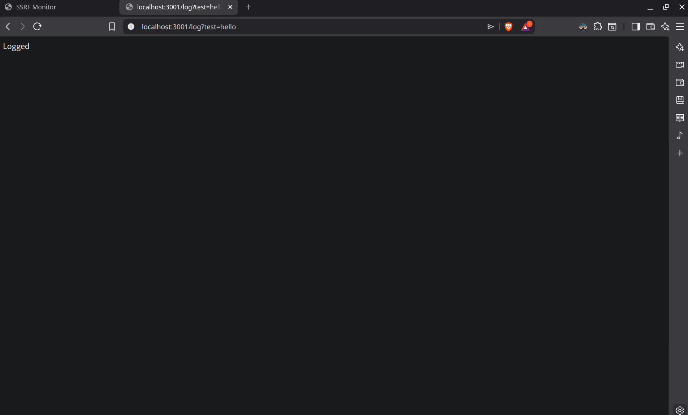

※以下はローカル環境内での暫定版。ngrokなど公開サーバーに置いた後、修正や手順変更の可能性あり

## 前提条件
- Node.jsをインストールしていること
- バージョン[v24.12.0]で動作確認している

## 準備
**./nodeJsServTest/express-ssrf2** 配下で以下コマンド
```
# 初期化とモジュールのインポート
npm init -y && npm install express
```

## 使用方法
### 起動方法
**./nodeJsServTest/** 配下で以下コマンド
```
npm run start:express2
```

### URL
- 管理画面（基本的にこの画面を使用する）
```
http://localhost:3001/admin
```



- アクセス監視用(このURLに対するアクセスを監視する)
```
http://localhost:3001/log?test=hello
```



## 検証方法のメモ（ngrokを使用する場合）
Linux環境を前提とし、ngrokをインストールしておく。
0) # 公式の安定版をインストール
```
curl -s https://ngrok-agent.s3.amazonaws.com/ngrok.asc | sudo tee /etc/apt/trusted.gpg.d/ngrok.asc >/dev/null && echo "deb https://ngrok-agent.s3.amazonaws.com buster main" | sudo tee /etc/apt/sources.list.d/ngrok.list && sudo apt update && sudo apt install ngrok
```
1) ターミナルを2画面起動しておく。1つ目はSSRF Monitor起動用、2つ目は公開サーバープロセス起動用（ngrok）。  (ngrokはバックグラウンドで動作させることでターミナルを閉じた状態で動かし続けることも可能なようだが、ターミナルでプロセスを落とせば（Ctrl+C）サービスも停止し非公開になるので、このやり方をメモしておく）

###### ターミナルA：
2) configにトークンを設定する
```
ngrok config add-authtoken <あなたのトークン>
```
3) ngrokを起動する
```
ngrok http 3001
```

4) ngrokで公開されたドメインがターミナルに表示されるので控えておく

###### ターミナルB：
5) 上記の使用方法に従ってブラウザから管理画面を開く
6) ブラウザの別タブから(4)の公開ドメインにアクセスする

###### 検証終了後：
7) 各ターミナル上で[Ctrl + C]を入力し、プロセスを終了する
